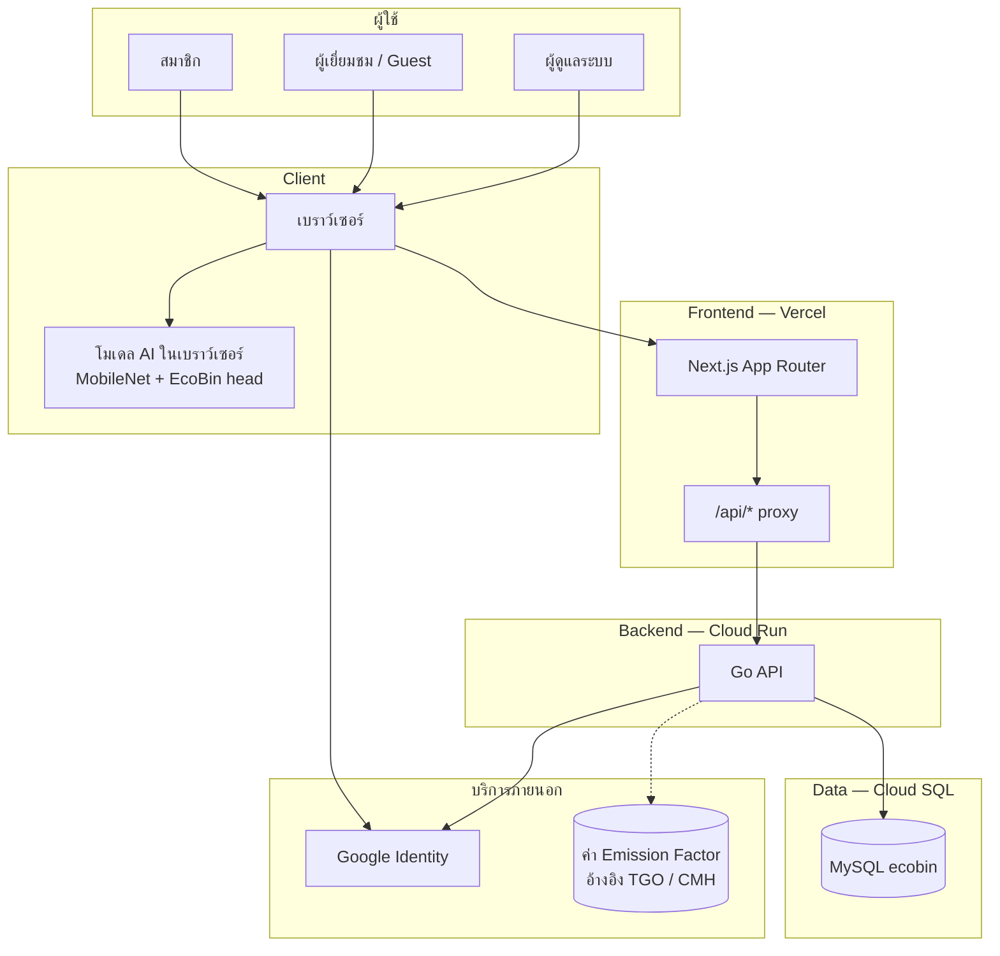
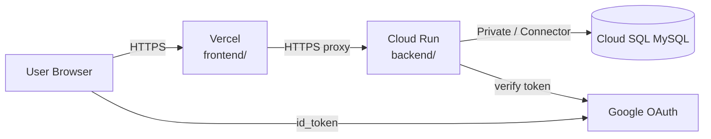
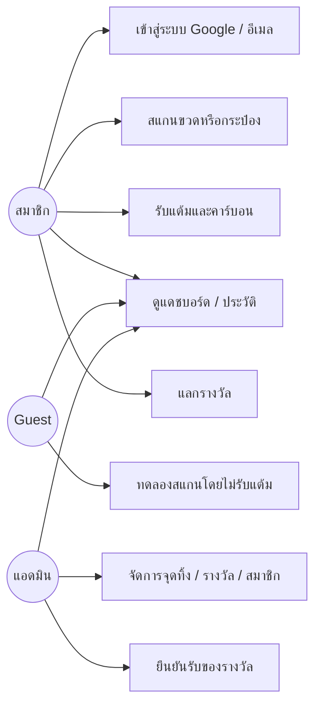
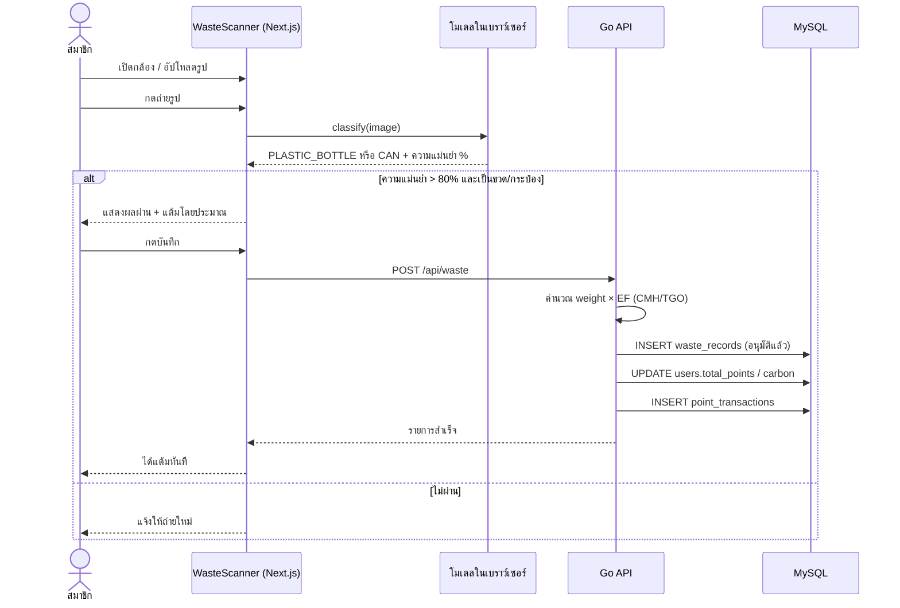
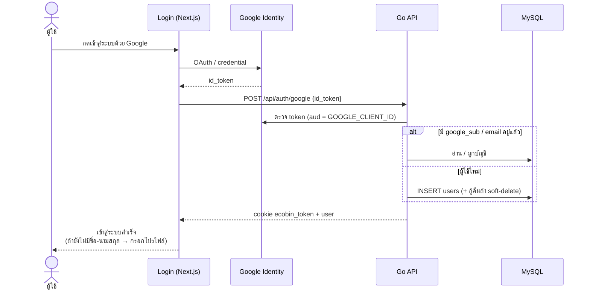
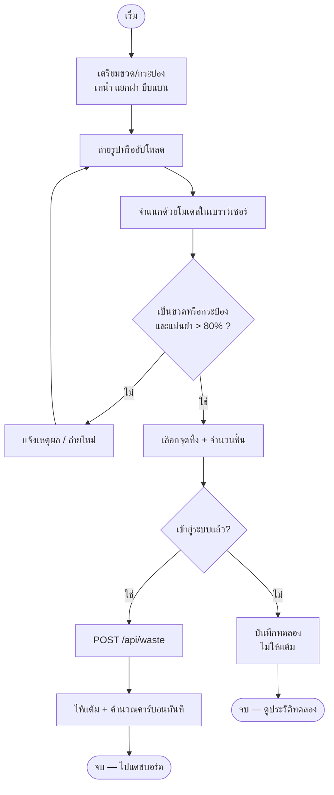
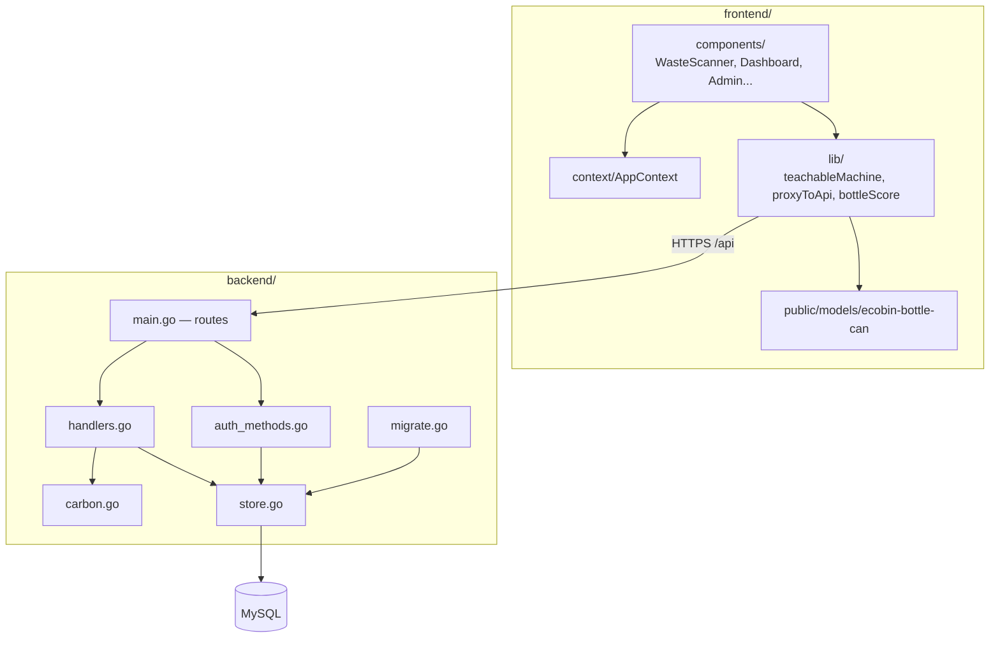
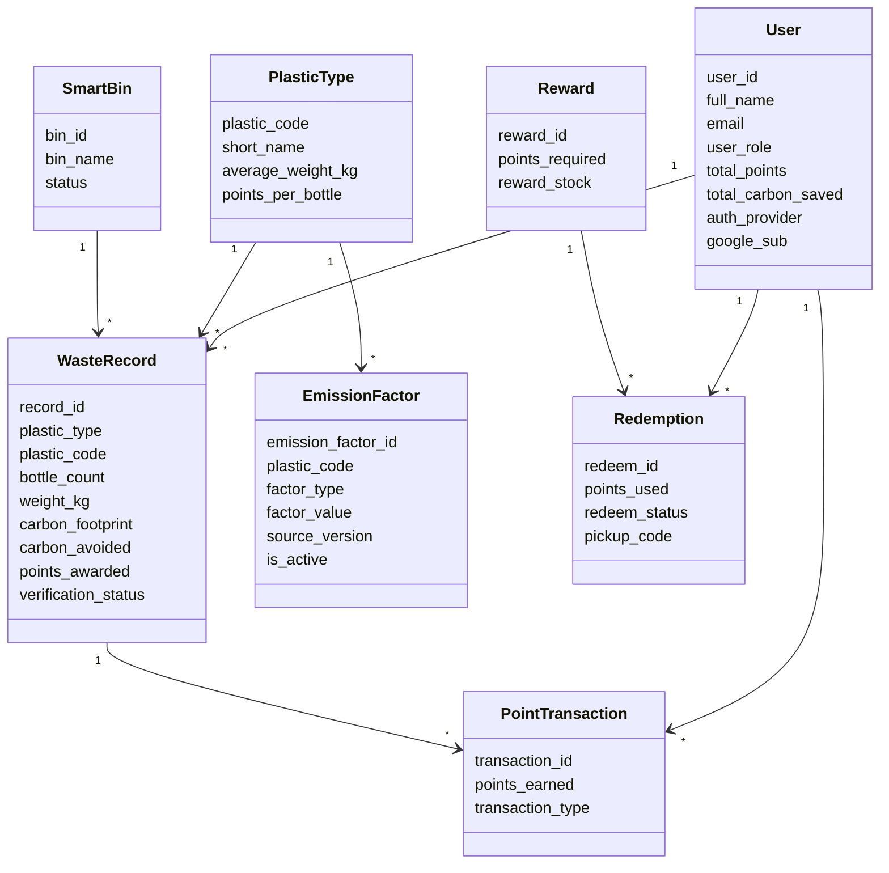

# EcoBin Connect — Architecture & UML

เอกสารนี้สรุป**สถาปัตยกรรมจริงของระบบปัจจุบัน** และไดอะแกรม UML สำหรับงานวิจัย / สอบ / นำเสนอ  
(อัปเดตให้ตรงกับ flow: ถ่ายรูป → จำแนกในเบราว์เซอร์ → ให้แต้มทันที → คำนวณคาร์บอนแบบ CMH/TGO)

**เปิดใน draw.io:** [`../diagrams/uml/ecobin-uml-architecture.drawio`](../diagrams/uml/ecobin-uml-architecture.drawio)  
(มี 8 แท็บ: Architecture, Deployment, Use Case, Sequence สแกน, Sequence Google, Activity, Component, Class)

---

## 1. สถาปัตยกรรมระบบ (Architecture)

### 1.1 ภาพรวม (C4 ระดับ Context + Container)



### 1.2 หน้าที่แต่ละชั้น

| ชั้น | เทคโนโลยี | หน้าที่ |
|---|---|---|
| Presentation | Next.js (Vercel) | UI สมาชิก / Guest / Admin, เปิดกล้อง, อัปโหลดรูป |
| Client AI | TensorFlow.js + MobileNet | จำแนกขวดพลาสติก / กระป๋อง / ไม่ผ่าน ในเบราว์เซอร์ |
| API Gateway (thin) | Next.js Route `/api/[...path]` | Proxy ไป Cloud Run, ส่ง cookie เซสชัน |
| Application | Go (Cloud Run) | Auth, บันทึกขยะ, แต้ม, รางวัล, Admin |
| Persistence | MySQL (Cloud SQL) | ผู้ใช้, รายการขยะ, แต้ม, EF, จุดทิ้ง |
| External | Google OAuth, แหล่ง EF ของ TGO/CMH | ล็อกอิน, อ้างอิงค่าคาร์บอน |

### 1.3 หลักการออกแบบสำคัญ

1. **แยก Frontend กับ Backend คนละ deploy** — ปิดโน้ตบุ๊กได้ ระบบยังทำงาน  
2. **จำแนกภาพฝั่ง client** — ไม่ส่งรูปไป Teachable Machine ภายนอกเพื่อ classify; ใช้โมเดลใน `/public/models/ecobin-bottle-can/`  
3. **Same-origin proxy** — เบราว์เซอร์เรียก `/api` บนโดเมนเว็บ ลดปัญหา CORS/cookie  
4. **ให้แต้มทันทีหลังสแกนผ่าน** — สถานะ `อนุมัติแล้ว` ตอนสร้างรายการ (ไม่รอแอดมิน)  
5. **คาร์บอน = มวล × EF** ตามแนว [CMH Calculate](https://circularmaterialhub.com/Calculate.php) ที่อ้าง TGO  

### 1.4 Deployment



| สภาพแวดล้อม | Frontend | Backend | DB |
|---|---|---|---|
| Production | Vercel | Cloud Run `asia-southeast1` | Cloud SQL |
| Local | `npm run dev` :3000 | Go :8080 | MySQL local / Cloud SQL |

---

## 2. UML — Use Case Diagram



**ขอบเขตระบบ (System boundary):** EcoBin Connect Web Application  

**หมายเหตุ Guest:** สแกน/ทดลองได้ แต่ไม่ได้รับแต้มจริง — ต้องเข้าสู่ระบบก่อน

---

## 3. UML — Sequence: สแกนและให้แต้ม (Happy Path สมาชิก)



---

## 4. UML — Sequence: เข้าสู่ระบบ Google



---

## 5. UML — Activity: กระบวนการสแกน



---

## 6. UML — Component / Package



---

## 7. UML — Class / Domain (สรุปเอนทิตีหลัก)



รายละเอียด ER แบบเต็มมีในไฟล์ draw.io:

- `docs/diagrams/er/ecobin-er-model-full.drawio`
- `docs/diagrams/er/ecobin-er-schema.drawio`
- `docs/diagrams/er/ecobin-er-relationships-1m.drawio`

---

## 8. Data Flow (สรุปจาก DFD ที่มีอยู่)

| ระดับ | ไฟล์ | เนื้อหา |
|---|---|---|
| Context | `docs/diagrams/context/ecobin-context-diagram.drawio` | ระบบกับภายนอก |
| DFD 0 | `docs/diagrams/dfd/ecobin-dfd-level0.drawio` | กระบวนการหลัก |
| DFD 1 | `docs/diagrams/dfd/ecobin-dfd-level1-process1..4.drawio` | แตกกระบวนการย่อย |

**กระแสข้อมูลหลักปัจจุบัน**

```
รูปภาพ → จำแนก (Client AI) → ผลประเภท + ความแม่นยำ
  → บันทึก waste_records + carbon + points (Go API)
  → อัปเดต users / point_transactions
  → แสดงบน Dashboard / History
```

---

## 9. ตารางเทียบ UML ที่ใช้ในเล่มวิจัย

| ไดอะแกรม | ใช้แสดงอะไร | อยู่ในเอกสารนี้ |
|---|---|---|
| Use Case | ใครทำอะไรในระบบ | §2 |
| Sequence | ลำดับการทำงานตามเวลา | §3–4 |
| Activity | การตัดสินใจใน flow สแกน | §5 |
| Component / Deployment | โครงสร้างและที่ deploy | §1, §6 |
| Class / ER | โครงสร้างข้อมูล | §7 + draw.io |

---

## 10. ข้อควรใส่ในบท Architecture ของเล่ม

1. ระบบเป็น **Web Application แบบ 3-tier** (Presentation / Application / Data)  
2. AI จำแนกขยะรัน **ฝั่ง client** เพื่อลดภาระเซิร์ฟเวอร์และ latency  
3. Backend เป็น **stateless API** บน Cloud Run เชื่อม Cloud SQL  
4. ความปลอดภัย: Google ID token ตรวจฝั่งเซิร์ฟเวอร์, เซสชันด้วย cookie, role Admin/Member  
5. ความยั่งยืนของตัวเลขคาร์บอน: ใช้ EF จากแหล่ง TGO ผ่านแนวทาง CMH ไม่ hard-code แบบสุ่ม  

---

## ไฟล์ที่เกี่ยวข้องในโค้ด

| ส่วน | path |
|---|---|
| สแกน + UI | `frontend/src/components/WasteScanner.tsx` |
| โหลดโมเดล | `frontend/src/lib/teachableMachine.ts` |
| Proxy API | `frontend/src/lib/proxyToApi.ts` |
| Routes | `backend/main.go` |
| สร้างรายการขยะ / แต้ม | `backend/handlers.go` |
| คาร์บอน | `backend/carbon.go` |
| Schema / migrate | `infra/schema.sql`, `backend/migrate.go` |
